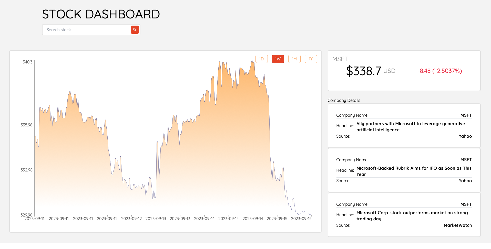
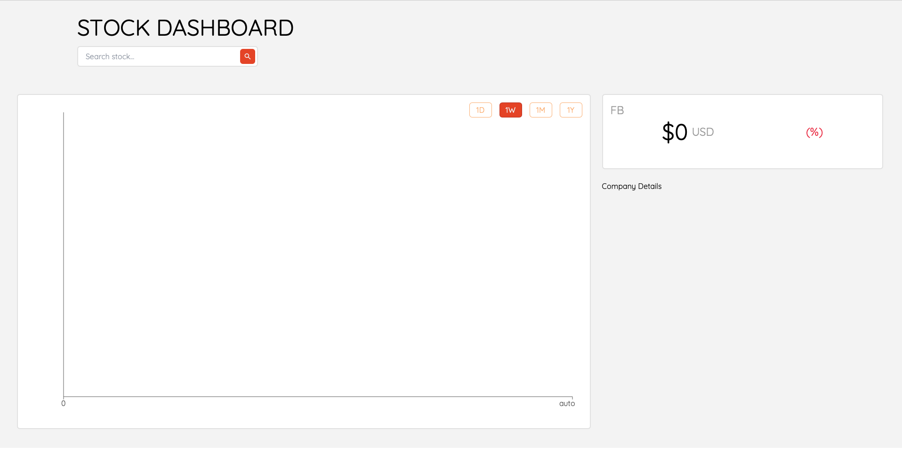
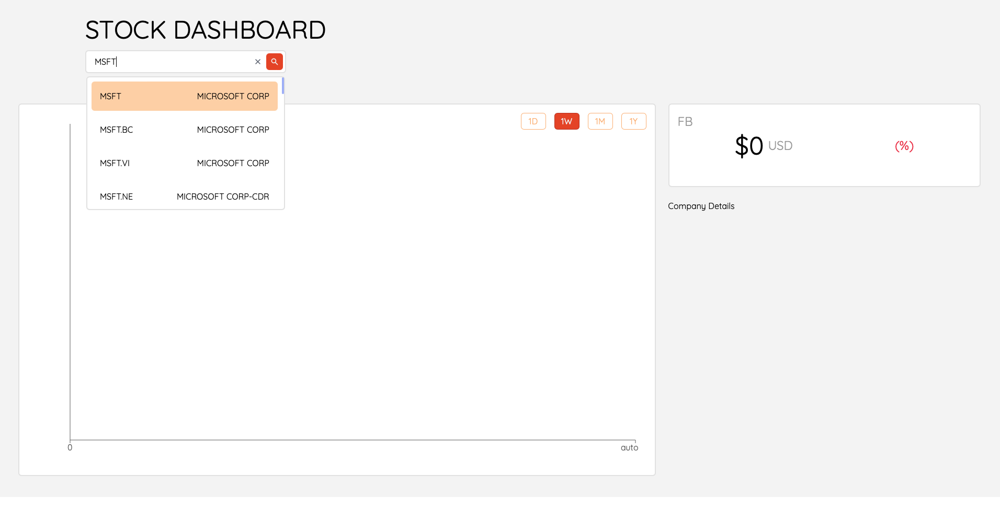

# StockPulse
A web application that allows users to access stock market information using the Finnhub API. 

 


# What is the project?

The StockPulse Dashboard App is a web application that allows users to access essential stock market information using the Finnhub API. With this app, users can search for stocks, get real-time quotes, retrieve detailed stock information, view historical chart data, and stay informed with the latest headlines related to the company.


# 2. Framewroks and Languages Used:

- React
- Tailwind CSS
- JavaScriopt
- Finnhub API
  


# 4. Installation:

installion is rather simple

i. Clone the git repo

```
https://github.com/SheldonDacon/StockPulse.git
```

ii. Open project folder

-In the terminal type npm build

iii. format env file and add finhub api key
-.env file
```
REACT_APP_API_KEY = "(your finhub api key)"
```

-  Obtain an API key from finhub, URL: https://finnhub.io Then select "get free API key" to get your API key.


# 5. How To Use:

i. Open project in preferred IDE. I'm using VSCode.

ii. Run the live server using uvicorn.

```commandline
- npm start
```

iii. Open selected port on your browser


# 6. Demo:

Once the Web browser loads, it should be an empty screen with no company selected:

 

Then select any company in the drop down search bar:

 

Then once you hit enter the stock price of the selected stock will appaer along with a graoph of the stock and kits changes within then day, month and year. The most recent news helaines about the company will also be shown along with the the the news sources.
 


# 8. Inspiration:

I got the main idea from a  tutorial by Domenic Labbate, but I decided  to add many more crucial feautures. Check out his youtube channel:

URL: https://www.youtube.com/@domtheengineer
